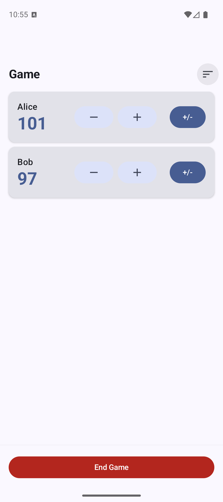
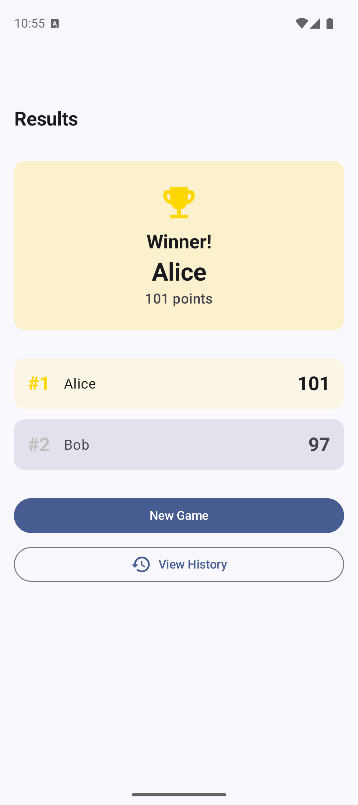

# PlayScore

A simple Android app to keep score during family & friends game evenings.

## Install

To install PlayScore on your Android device:
1. **Download the APK:**  
   Go to the [GitHub Releases page](https://github.com/YOUR_GITHUB_USERNAME/PlayScore/releases) and download the latest `app-release.apk` file under "Assets".  
   - Choose the `app-release.apk` (not `app-debug.apk`) for normal use.
2. **Install the APK:**  
   - On your Android device, open the downloaded APK file.  
   - If prompted, allow installation from unknown sources.  
   - Follow the on-screen instructions to complete installation.
> **Note:** If you have trouble installing, see [Install APKs from unknown sources](https://www.androidcentral.com/how-install-apk-android) for more help.

## Screenshots

<p align="center">
  
  
</p>

## Features

- **Player Management**: Maintain a list of frequent players, add new ones, remove obsolete ones
- **Game Sessions**: Track scores for selected players with quick +1/-1 buttons or custom values
- **Sorting Options**: View scores sorted by highest/lowest, alphabetically, or original order
- **Results & History**: Final standings with winner highlighted, games saved to history
- **Material Design 3**: Modern UI with Jetpack Compose

## Requirements

- Android 7.0 (API level 24) or higher

## Building the App

### Prerequisites

1. Ensure you have the Nix development environment set up (see CLAUDE.md)
2. Enter the development shell:
   ```bash
   nix develop
   ```

### Build and Install

```bash
cd playscore
./gradlew build           # Build the app
./gradlew installDebug    # Install on device/emulator
```

## Project Structure

```
playscore/
├── app/src/main/java/org/surfsite/playscore/
│   ├── MainActivity.kt
│   ├── PlayScoreApplication.kt
│   ├── data/
│   │   ├── local/          # Room database, DAOs, entities
│   │   └── repository/     # Data repositories
│   └── ui/
│       ├── theme/          # Material 3 theming
│       ├── navigation/     # Navigation graph
│       ├── players/        # Player management screen
│       ├── game/           # Active game screen
│       ├── results/        # Final standings screen
│       └── history/        # Game history screen
├── build.gradle.kts
└── SPEC.md                 # Detailed specification
```

## Technical Details

- **Language**: Kotlin
- **UI**: Jetpack Compose with Material 3
- **Architecture**: MVVM with ViewModels and StateFlow
- **Database**: Room for local persistence
- **Navigation**: Navigation Compose
- **Min SDK**: 24 (Android 7.0)
- **Target SDK**: 36 (Android 15)
- **Build System**: Gradle 8.14 with Kotlin DSL

## License

This project is dual-licensed under either:

- Apache License, Version 2.0 ([LICENSE-APACHE](LICENSE-APACHE) or http://www.apache.org/licenses/LICENSE-2.0)
- MIT license ([LICENSE-MIT](LICENSE-MIT) or http://opensource.org/licenses/MIT)

at your option.
